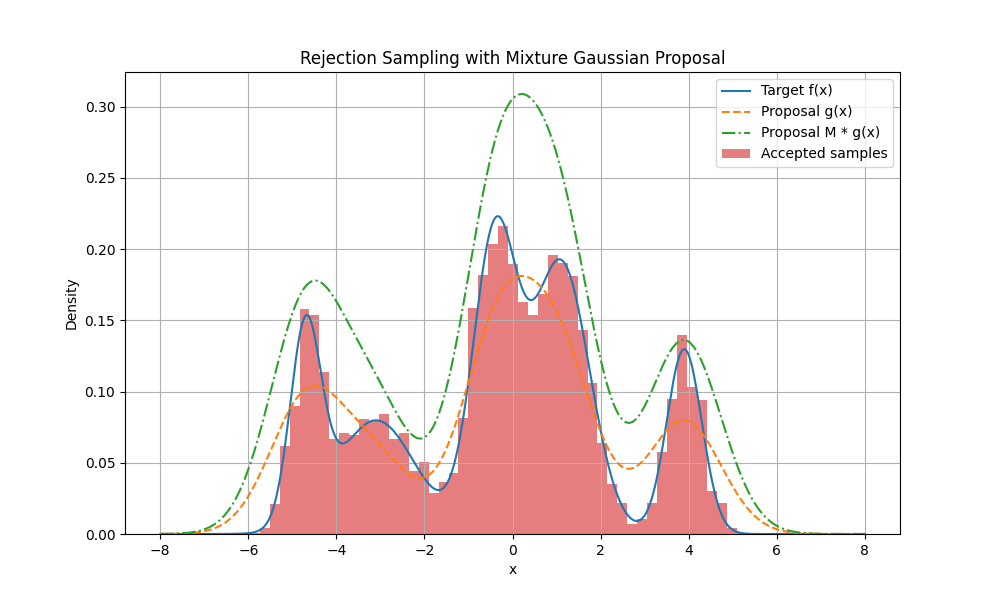
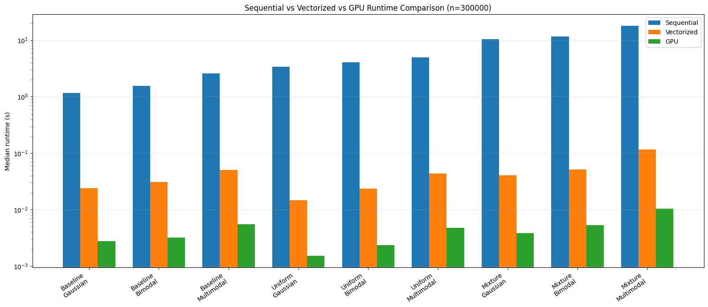
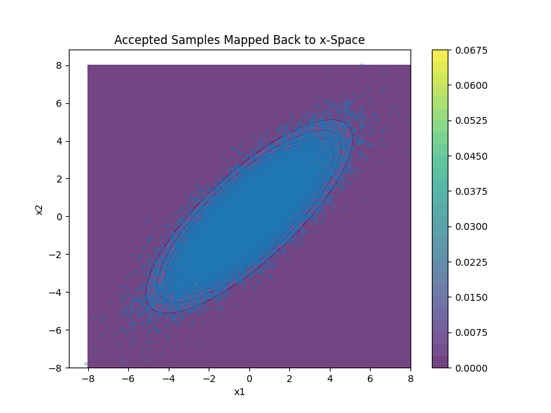

# Rejection Sampling Optimization

This project explores several ways to improve rejection sampling efficiency through better proposal distributions, vectorization, GPU acceleration, and whitening. This project was completed as the final course project for UBC CPSC 440, Advanced Machine Learning, by [Aadit Rao](https://github.com/Aadit1004) and [Matthew Mung](https://github.com/mmung3).

## How to Run

Make sure Python is installed, along with the required libraries:

```
pip install numpy matplotlib scipy
```

If you would also like to run the GPU benchmarks, install CuPy as well:
```
pip install "cupy-cuda12x[ctk]"
```
**Note:** Benchmark experiments require an NVIDIA GPU with CUDA support. The rest of the project can still be run without CuPy.

Then move into the `src` directory and run:

```
cd src
python main.py
```

If you would like to run the benchmarks as well, use the `--benchmarks` flag:
```
python main.py --benchmarks
```

## Example Results
Some of our experiment results are shown below.




